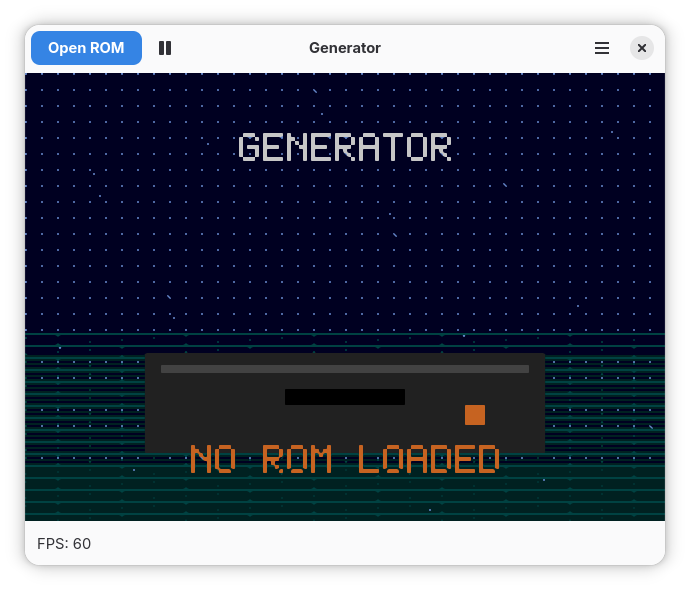

# Generator - Sega Genesis/Mega Drive Emulator

Generator is a Sega Genesis (Mega Drive) emulator featuring modern UI options, high-quality upscaling, and accurate emulation.



## Quick Start

### Build with Meson

```bash
# Install dependencies (Arch Linux)
sudo pacman -S meson ninja gtk4 libadwaita sdl3

# Install dependencies (Debian/Ubuntu)
sudo apt-get install meson ninja-build libgtk-4-dev libadwaita-1-dev libsdl3-dev

# Configure and build
meson setup build -Dui-backend=gtk4
meson compile -C build

# Run
./build/src/app/generator-gtk4 [rom-file.bin]
```

### NodalKit UI (macOS, or Linux without GTK)

[NodalKit](https://github.com/kidoz/nodalkit) is a C++23 GUI toolkit pulled in
automatically as a Meson subproject (`subprojects/nodalkit.wrap`), so the only
system dependency is SDL3 (audio output and gamepads). This is the backend to
use on macOS, where it renders through Metal.

```bash
# macOS
brew install meson ninja sdl3

# Linux
sudo pacman -S meson ninja sdl3                     # Arch
sudo apt-get install meson ninja-build libsdl3-dev  # Debian/Ubuntu

meson setup build -Dui-backend=nodalkit
meson compile -C build

./build/src/app/generator-nodalkit [rom-file.bin]
```

### Console UI (no GTK required)

```bash
# Minimal dependencies
sudo pacman -S meson ninja sdl3  # Arch
sudo apt-get install meson ninja-build libsdl3-dev  # Debian/Ubuntu

# Build console version
meson setup build -Dui-backend=console
meson compile -C build

# Run
./build/src/app/generator-console [rom-file.bin]
```

A `generator-headless` binary is built alongside any UI backend and is used
by the test/regression harness.

## Build Options

### UI Backends

- `gtk4` - Modern GTK4/libadwaita interface (recommended on Linux, default)
- `nodalkit` - NodalKit interface, built from a Meson subproject; the macOS backend
- `console` - SDL3-based lightweight interface

### Z80 Emulator

Single C++23 backend: [kidoz/z80f](https://github.com/kidoz/z80f), pulled in
automatically as a Meson subproject (`subprojects/z80f.wrap`) and wired
through `src/z80/z80.cpp`. No build option to choose;
nothing to install.

### Build Examples

```bash
# GTK4 (recommended on Linux)
meson setup build -Dui-backend=gtk4

# NodalKit (macOS, or Linux without GTK)
meson setup build -Dui-backend=nodalkit

# Console (lightweight)
meson setup build -Dui-backend=console

# Release build (optimized)
meson setup build --buildtype=release -Dui-backend=gtk4
```

## Dependencies

### Required

- **Meson** >= 0.60.0
- **Ninja** build system
- **GCC** >= 13 or Clang >= 16 (C23 support required)
- **SDL3** >= 3.0.0

### GTK4 Backend (recommended)

- GTK4 >= 4.10.0
- libadwaita >= 1.4.0

### Optional

- **libjpeg** - for JPEG screenshot support

## Usage

```bash
# Run with ROM
./build/src/app/generator-gtk4 ~/roms/sonic.bin

# Run console version
./build/src/app/generator-console ~/roms/sonic.bin
```

### Keyboard Shortcuts (GTK4)

- `Ctrl+O` - Open ROM
- `Ctrl+L` - Load State
- `Ctrl+S` - Save State
- `F5` - Reset
- `Space` - Pause/Resume
- `Ctrl+Q` - Quit

## Supported ROM Formats

- `.bin` - Raw binary ROM dumps
- `.smd` - Interleaved SMD format (auto-detected)
- `.gen` - Genesis ROM files
- `.md` / `.rom` - Raw ROM images using alternate extensions

## Features

- **xBRZ Upscaling** - High-quality pixel art upscaling (2x, 3x, 4x)
- **Scale2x/3x/4x** - Fast EPX-based upscaling algorithms
- **Save States** - Full save/load state support
- **YM2612 + SN76496** - Accurate sound emulation

## Architecture

### CPU Emulation

- **68000**: C++23 core in `src/m68k/`, integrated with the machine bus and
  master-clock scheduler
- **Z80**: [z80f](https://github.com/kidoz/z80f) (C++23) via Meson subproject,
  integrated through `src/z80/z80.cpp`.

### Project Structure

```
generator/
├── include/
│   └── generator/  # Header files (shared across components)
├── src/
│   ├── core/       # Emulator core and context
│   ├── cpu/        # 68k and Z80 emulation
│   ├── audio/      # YM2612 + SN76496
│   ├── video/      # VDP and rendering helpers
│   ├── platform/   # SDL3 platform layer
│   ├── persist/    # Save states, AVI, patching
│   ├── ui/         # GTK4, console, headless
│   ├── xbrz/       # xBRZ image upscaler (C++23)
│   └── app/        # Entry point and event loop
└── meson.build    # Build configuration
```

## Using Justfile

For convenience, a `justfile` is provided:

```bash
# Install just command runner
sudo pacman -S just  # Arch
sudo apt-get install just  # Debian/Ubuntu

# Build and run
just run-gtk4 /path/to/rom.bin
just run-console /path/to/rom.bin

# List all commands
just --list
```

## Authors

Aleksandr Pavlov <ckidoz@gmail.com>

See [AUTHORS.md](AUTHORS.md) for full attribution.

## License

Generator is licensed under the GPL-2.0-or-later license. See [LICENSE](LICENSE).
